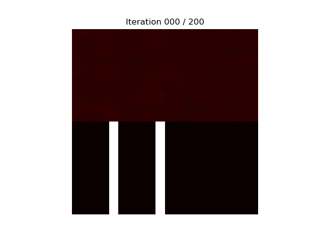

# PyTorch Attention Mechanism

PyTorch "clone" of [this amazing keras version](https://github.com/philipperemy/keras-attention-mechanism). The main purpose of both original and this replication is to provide an easy to use implementation of many-to-one attention.

## Other examples

Browse [examples](./examples/)

### Adding two numbers

Let's consider the task of adding two numbers that come right after some delimiters (0 in this case):

`x = [1, 2, 3, 0, 4, 5, 6, 0, 7, 8]`. Result is `y = 4 + 7 = 11`.

The attention is expected to be the highest after the delimiters. An overview of the training is shown below, where the
top represents the attention map and the bottom the ground truth. As the training  progresses, the model learns the 
task and the attention map converges to the ground truth.

  

## TODO

- [ ] Packaged version
- [ ] CI inclusion
- [x] replicate `add_two_numbers.py`
- [ ] replicate `example-attention.py`
- [ ] replicate `find_max.py`
- [ ] replicate `imdb.py`
